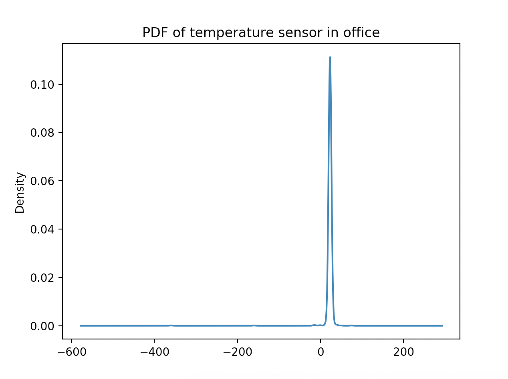
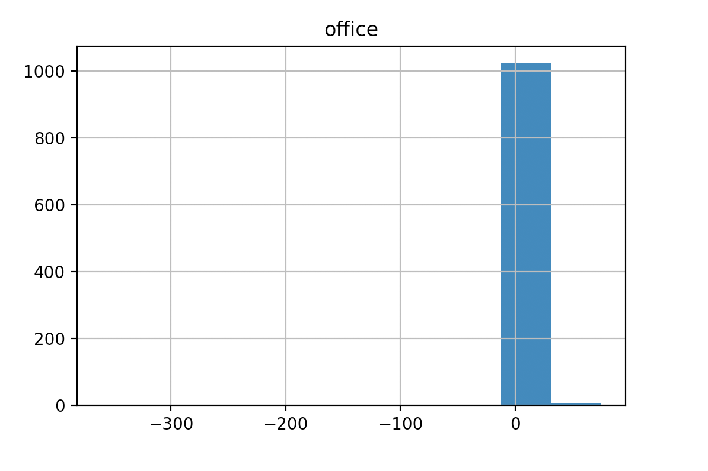
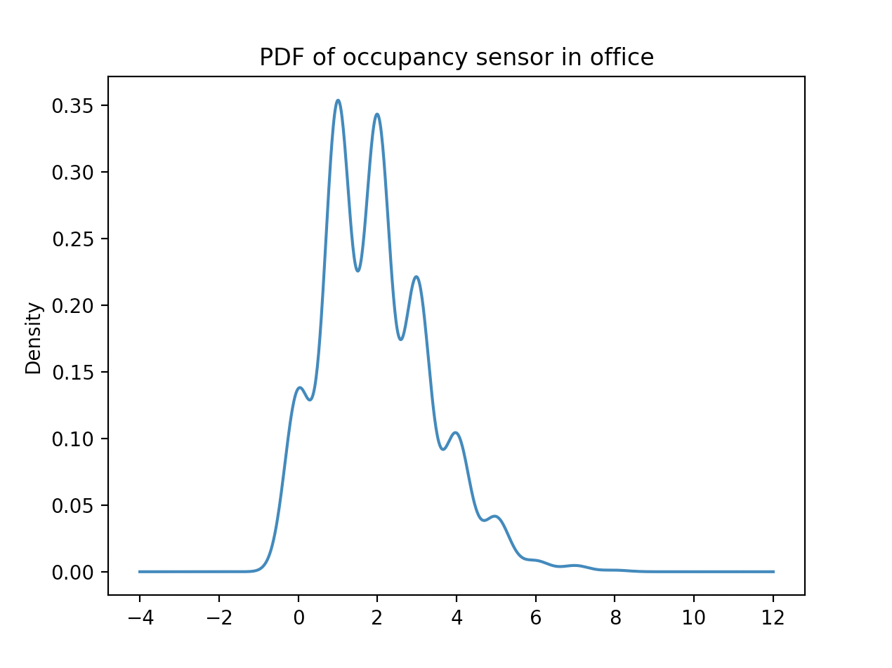
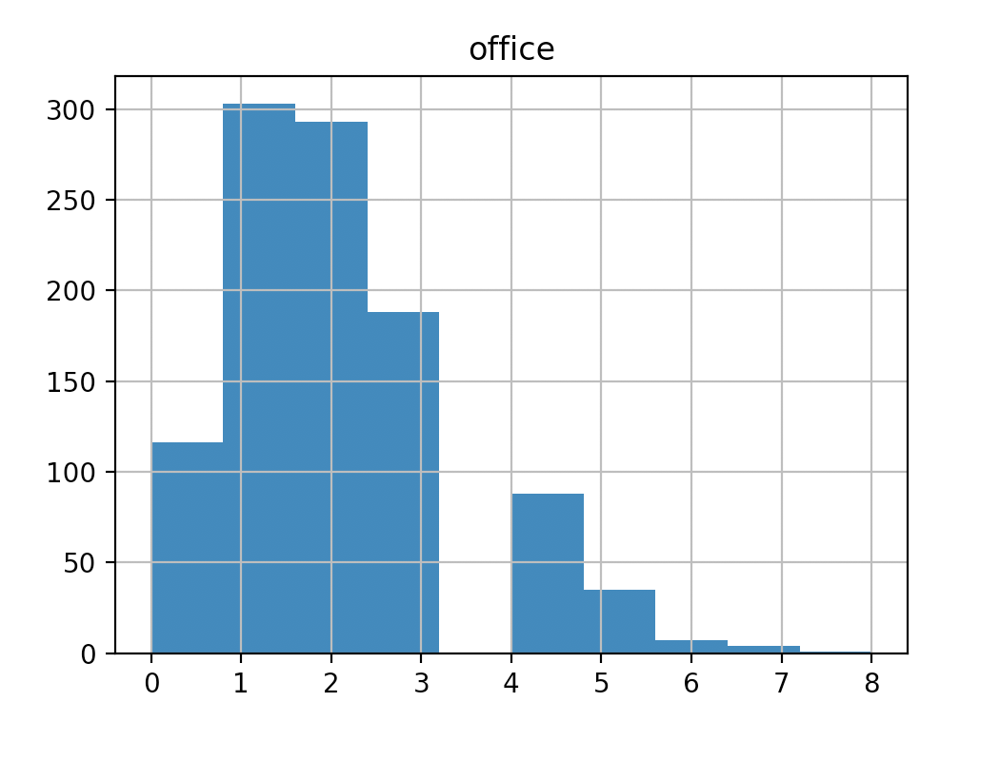
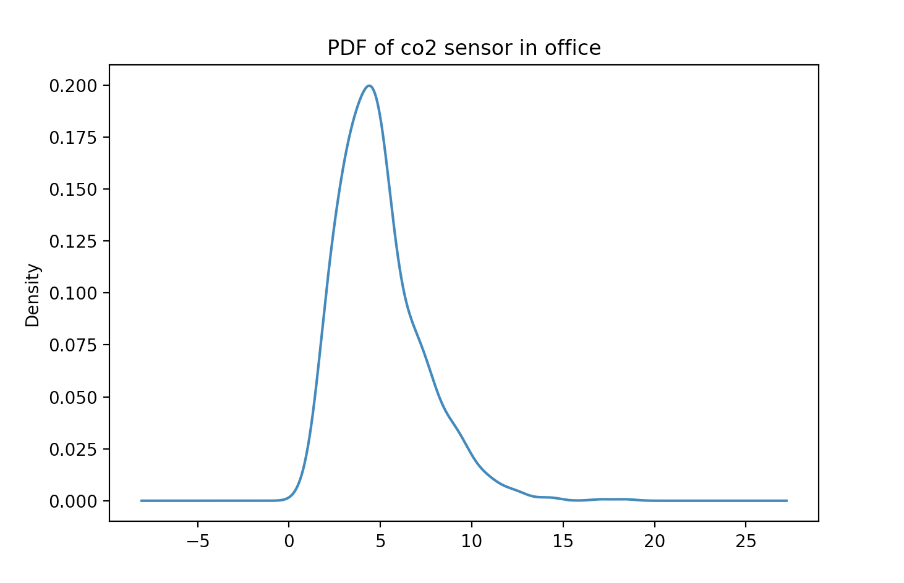
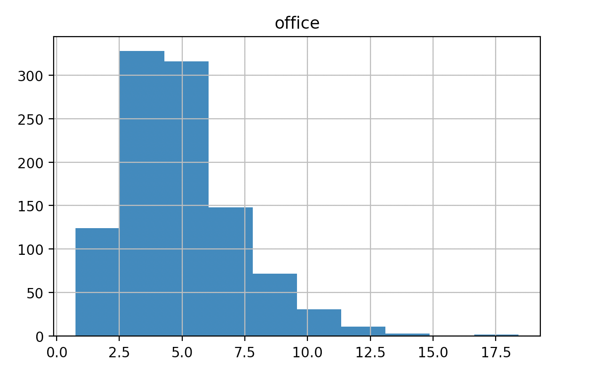
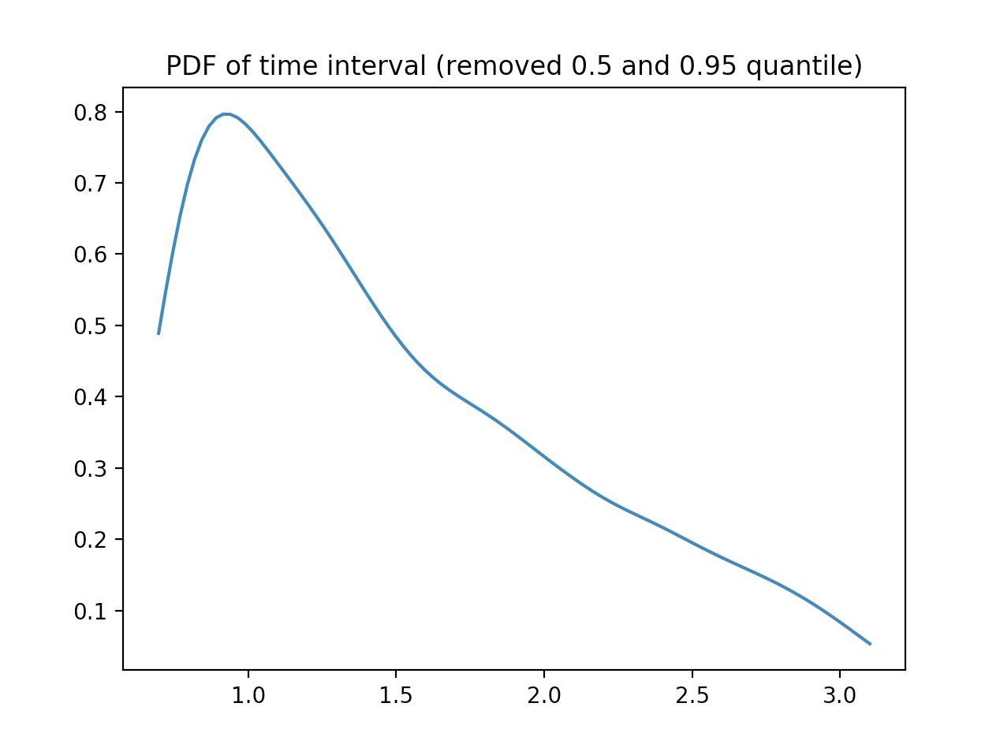
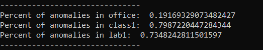

# Sensor Mini Project Report
## Task 0: 
The greeting string is: ECE Senior Capstone IoT simulator
## Task 1: 
Code was added to client.py to save data to a file when a .txt file name is provided when it is run.
## Task 2: 
We ran the server and collected the data in the file 'data.txt', which has 3130 data values.
* For the **temperature data**, the median and variance of each room are: 

 Room | Median | Variance 
 ----------- | ----------- | ----------- 
 class1 | 26.980973 | 20.570161 
 lab1 | 21.000710 | 3.135624 
 office | 23.008981 | 185.155364 
* For the **occupancy data**, the median and variance of each room are:

 Room | Median | Variance 
 ----------- | ----------- | ----------- 
 class1 | 19.0 | 19.203707 
 lab1 | 5.0 | 5.099918 
 office | 2.0 | 1.808376 
 
* We plotted probability density function for each sensor type from the office room which are as follow: 

*PDF are plotted in two formats, the left one is line graph and the right one is histogram.*

**Temperature sensor**

**Occupancy sensor**

**CO2 sensor**

* We ran the server for a period of time. The median and variance of **Time interval** between sensor readings are:

 Median | Variance 
 ----------- | ----------- 
0.6966920000000001 | 1.062734582236113

> Consider the value of median, there might be errors in readings

**Probability density function of the time interval**

What is the mean and variance of the time interval of the sensor readings? Please plot its probability density function. Does it mimic a well-known distribution for connection intervals in large systems? [8 points] 

## Task 3:
* For our anomaly detection algorithm, we defined an anomaly to be outside of two standard deviations of the mean, and used these values to find anomalies and add them to a list, which is then returned. This was done in the analyze.py file, in the function detectAnomalies. The output of the function is displayed below, and shows a list of all the anomalies from each room, as well as the percentage of anomalies out of the total values collected.
* 
* A persistent change in temperature may indicate a failed sensor, but it could also mean there is something wrong with the temperature of the room itself (e.g. a persistent higher temperature could indicate a fire). This is dependent on whether the sensor would continue to perform and send data under these conditions, but if so, this could be a reason for a persistent change in temperature, so this would not always indicate a failed sensor. However, since this project was using simulated sensors, I would assume that if there is a persistent change, it would indicate a malfunction with the simulated sensor since there isn't a physical room which may be having an external issue causing a change in temperature. 
* Since for our algorithm, we defined an upper and lower bound for detecting an anomaly, we can use those as our possible bounds for room temperature: 

 Room | Lower Bound | Upper Bound 
 ----------- | ----------- |----------- 
 class1 | 17.756367534250455 | 35.889437592286356
 lab1 | 17.54055048399767 | 24.620248204447925
 office | -4.757673873048333 | 49.644748112366656
 
 * The bounds for both class1 and lab1 seem reasonable, whereas for the office, the bounds are outside of what would be considered a normal temperature for a building. This likely means that the standard deviation was greater for the office, so the finding bounds from the mean lead to a greater range of 'valid' temperatures than would actually be reasonable. Since our algorithm was relatively basic, it did not account for this issue. 
 
## Task 4:
* The difficulty of initially using this Python websockets library seemed to be less compared to a compiled language like C++. For context, in our team, we were both unfamiliar with Python as well as working with websockets. From looking at the examples of C++ websockets libraries, as well as an [online example of a C++ websocket](https://www.netburner.com/learn/websockets-for-real-time-web-and-iot-applications/), we found the Python syntax, which is much closer to pseudo-code/english, made it much easier to understand this Python websockets library, and what particular parts of the code were doing. Furthermore, there was relatively thorough documentation of the Python library that made working with it easier.

* If the server polled the sensors, there would inevitably be connections where the sensors don't yet have data. On the other hand, if the sensors reach out to the server, that wouldn't be an issue as it would be guaranteed that there was data to be passed along. Additionally, having the sensors send the data when they get it means that they wouldn't need to use their storage to keep data if the server hasn't polled it yet, which may be good if they have limited storage. 
